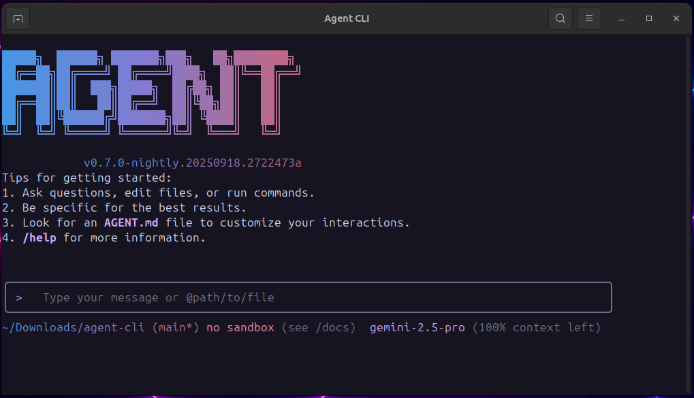

# Agent CLI

[](https://github.com/dloring1988/agent-cli/actions/workflows/ci.yml)
[](https://github.com/dloring1988/agent-cli/actions/workflows/e2e.yml)
[](https://www.npmjs.com/package/@dloring1988/agent-cli)
[](https://github.com/dloring1988/agent-cli/blob/main/LICENSE)



Agent CLI is an open-source AI agent that brings the power of large language models directly into your terminal.

## 🚀 Why Agent CLI?

- **🧠 Powerful**: Access to powerful large language models.
- **🔧 Built-in tools**: File operations, shell commands, web fetching.
- **🔌 Extensible**: MCP (Model Context Protocol) support for custom integrations.
- **💻 Terminal-first**: Designed for developers who live in the command line.
- **🛡️ Open source**: Apache 2.0 licensed.

## 📦 Installation

### Quick Install

#### Run instantly with npx

```bash
# Using npx (no installation required)
npx https://github.com/dloring1988/agent-cli
```

#### Install globally with npm

```bash
npm install -g @dloring1988/agent-cli
```

#### System Requirements

- Node.js version 20 or higher
- macOS, Linux, or Windows

## 📋 Key Features

### Code Understanding & Generation

- Query and edit large codebases
- Generate new apps from PDFs, images, or sketches using multimodal capabilities
- Debug issues and troubleshoot with natural language

### Automation & Integration

- Automate operational tasks
- Use MCP servers to connect new capabilities
- Run non-interactively in scripts for workflow automation

### Advanced Capabilities

- Ground your queries with web search for real-time information
- Conversation checkpointing to save and resume complex sessions
- Custom context files (AGENT.md) to tailor behavior for your projects

### GitHub Integration

Integrate Agent CLI directly into your GitHub workflows with [**Agent CLI GitHub Action**](https://github.com/dloring1988/run-agent-cli):

- **Pull Request Reviews**: Automated code review with contextual feedback and suggestions
- **Issue Triage**: Automated labeling and prioritization of GitHub issues based on content analysis
- **On-demand Assistance**: Mention `@agent-cli` in issues and pull requests for help with debugging, explanations, or task delegation
- **Custom Workflows**: Build automated, scheduled and on-demand workflows tailored to your team's needs

## 🚀 Getting Started

### Basic Usage

#### Start in current directory

```bash
agent
```

#### Include multiple directories

```bash
agent --include-directories ../lib,../docs
```

#### Non-interactive mode for scripts

Get a simple text response:

```bash
agent -p "Explain the architecture of this codebase"
```

For more advanced scripting, including how to parse JSON and handle errors, use
the `--output-format json` flag to get structured output:

```bash
agent -p "Explain the architecture of this codebase" --output-format json
```

### Quick Examples

#### Start a new project

```bash
cd new-project/
agent
> Write me a Discord bot that answers questions using a FAQ.md file I will provide
```

#### Analyze existing code

```bash
git clone https://github.com/dloring1988/agent-cli
cd agent-cli
agent
> Give me a summary of all of the changes that went in yesterday
```

## 📚 Documentation

- [**Quickstart Guide**](./docs/cli/index.md) - Get up and running quickly
- [**Configuration Guide**](./docs/cli/configuration.md) - Settings and customization
- [**Keyboard Shortcuts**](./docs/keyboard-shortcuts.md) - Productivity tips

## 🤝 Contributing

We welcome contributions! Agent CLI is fully open source (Apache 2.0), and we encourage the community to:

- Report bugs and suggest features
- Improve documentation
- Submit code improvements
- Share your MCP servers and extensions

See our [Contributing Guide](./CONTRIBUTING.md) for development setup, coding standards, and how to submit pull requests.

Check our [Roadmap](./ROADMAP.md) for planned features and priorities.

## 📖 Resources

- **[Roadmap](./ROADMAP.md)** - See what's coming next
- **[NPM Package](https://www.npmjs.com/package/@dloring1988/agent-cli)** - Package registry
- **[GitHub Issues](https://github.com/dloring1988/agent-cli/issues)** - Report bugs or request features
- **[Security Advisories](https://github.com/dloring1988/agent-cli/security/advisories)** - Security updates

### Uninstall

See the [Uninstall Guide](docs/Uninstall.md) for removal instructions.

## 📄 Legal

- **License**: [Apache License 2.0](LICENSE)
- **Terms of Service**: [Terms & Privacy](./docs/tos-privacy.md)
- **Security**: [Security Policy](SECURITY.md)

---

<p align="center">
  Built with ❤️ by the open source community
</p>